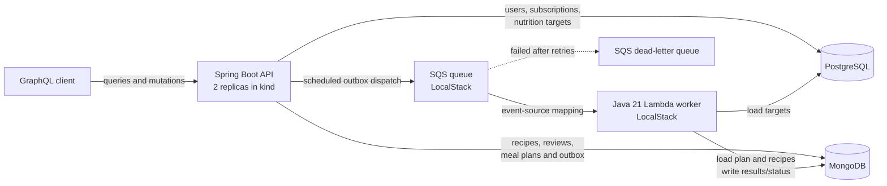

# NutriFlow

NutriFlow is a backend reference application for nutritionists and clients to
manage subscriptions, nutrition targets, recipes, and weekly meal plans. A
submitted plan is processed asynchronously to calculate weekly nutrients,
compare them with the client's targets, and produce an aggregated grocery list.

The project demonstrates a schema-first GraphQL API, polyglot persistence, an
outbox-based SQS workflow, a lightweight Java Lambda worker, and local
Kubernetes execution.

## Core functionality

- Register clients, nutritionists, and administrators.
- Connect a client to a nutritionist through an active subscription.
- Store daily calorie, protein, carbohydrate, and fat targets.
- Create, update, search, and soft-delete `KETO`, `VEGAN`, and
  `DIABETIC_FRIENDLY` recipes with diet-specific validation.
- Add one review per user and maintain each recipe's average rating.
- Build and validate seven-day meal plans with typed meals and active recipes.
- Suggest recipe swaps within the same diet and a ±15% calorie/protein range.
- Submit plans through an embedded MongoDB outbox and process them through SQS.
- Calculate weekly macros, grocery quantities, and target differences.
- Expose client dashboards and nested recipes efficiently with GraphQL batch
  loading.

## Architecture



The submission and outbox event are saved atomically in one meal-plan document.
Delivery is intentionally at-least-once: the worker claims a plan conditionally
and tracks the event ID so retries and duplicate messages do not duplicate
results. Plans finish as `PROCESSED` when targets are within tolerance,
`FLAGGED` when any configured target differs by more than 15%, or `FAILED`
before an SQS retry.

## Modules and infrastructure

| Path | Purpose |
| --- | --- |
| `api/` | Spring Boot GraphQL application, domain services, repositories, outbox dispatcher, health endpoints, and API Docker image |
| `contracts/` | Versioned `MealPlanSubmittedV1` event shared by producer and consumer |
| `worker/` | Non-Spring Java Lambda handler, calculation core, MongoDB/JDBC adapters, and shaded deployment JAR |
| `infra/localstack/` | Local SQS/DLQ initialization and Lambda deployment scripts |
| `k8s/base/` | Reusable namespace, ConfigMap, Secret template, Deployment, and Service |
| `k8s/local/` | Kustomize overlay that connects kind pods to Docker-hosted dependencies |
| `compose.yml` | PostgreSQL, MongoDB, and LocalStack services with persistent volumes |

PostgreSQL owns relational account and target data through Flyway migrations.
MongoDB owns flexible recipe and meal-plan aggregates and their indexes.
Business operations are GraphQL queries and mutations; Actuator health is
exposed over HTTP for operations and Kubernetes probes.

## Tech stack

- Java 21, Maven Wrapper, Spring Boot 3.4
- Spring GraphQL, Spring Data JPA, Spring Data MongoDB, Flyway, Actuator
- PostgreSQL 17 and MongoDB 8
- AWS SDK v2, SQS, Lambda, and LocalStack
- Docker Compose, kind, Kubernetes, and Kustomize
- JUnit 5, GraphQL Tester, Testcontainers, Awaitility, and Maven Failsafe
- GitHub Actions, kubeconform, and optional Amazon ECR publishing

## Run locally

Prerequisites are Java 21, Docker with Compose, and `curl`. The repository uses
`./mvnw`, so a separate Maven installation is not required.

Start the databases and LocalStack, verify the project, and run the API from the
host:

```bash
docker compose up -d --wait
./mvnw verify
./mvnw -pl api -am spring-boot:run
```

This development mode leaves SQS dispatch disabled by default. Open GraphiQL at
<http://localhost:8080/graphiql>, send GraphQL requests to
<http://localhost:8080/graphql>, and inspect health at
<http://localhost:8080/actuator/health>.

A minimal query is:

```graphql
query {
  status
}
```

Stop local services without deleting persisted volumes:

```bash
docker compose down
```

For manual LocalStack worker packaging, deployment, and inspection, see
[`infra/localstack/README.md`](infra/localstack/README.md).

## Run the complete flow on Kubernetes

Install `kubectl` and [kind](https://kind.sigs.k8s.io/) in addition to the local
prerequisites. The launcher packages both deployables, starts Docker
dependencies, deploys the Lambda and SQS mapping, builds and loads the API
image, creates/reuses the kind cluster, and waits for two healthy API replicas:

```bash
./k8s/run-local.sh
```

In another terminal, expose the ClusterIP service:

```bash
kubectl -n nutriflow port-forward service/nutriflow-api 8080:80
```

Then seed and execute the complete GraphQL → outbox → SQS → Lambda flow:

```bash
./k8s/e2e-demo.sh
```

The demo creates the users, subscription, targets, recipe, and seven-day plan,
submits it, and polls until the computed nutrient summary and grocery list are
available. Useful operational commands are:

```bash
kubectl -n nutriflow get deployment,pods,service
kubectl -n nutriflow logs deployment/nutriflow-api
kubectl -n nutriflow rollout status deployment/nutriflow-api
kind delete cluster --name nutriflow
docker compose down
```

In this local topology only the API runs in Kubernetes. PostgreSQL, MongoDB, and
LocalStack run in Docker Compose; LocalStack launches the Java Lambda worker in
its own runtime container.

## Configuration

All runtime settings are environment-driven:

| Variable | Default / purpose |
| --- | --- |
| `POSTGRES_URL`, `POSTGRES_USER`, `POSTGRES_PASSWORD` | PostgreSQL connection |
| `MONGODB_URI` | `mongodb://localhost:27017/nutriflow` |
| `SQS_ENABLED` | `false`; enables the publisher, dispatcher, and SQS health check |
| `SQS_QUEUE_URL` | Meal-plan event queue URL |
| `AWS_REGION` | `us-east-1` |
| `AWS_ENDPOINT_URL` | LocalStack endpoint locally; omitted on AWS |
| `AWS_ACCESS_KEY_ID`, `AWS_SECRET_ACCESS_KEY` | Local placeholders or AWS credentials |

Kubernetes non-secret values live in ConfigMaps. The committed Secret file is
only a template; `k8s/run-local.sh` creates local development credentials at
runtime. Do not commit real credentials.

## Verification and delivery

```bash
./mvnw test          # unit and regular integration tests
./mvnw clean verify  # full build, Testcontainers, and SQS-to-Lambda test
docker compose config
kubectl kustomize k8s/local
```

Tests cover domain validation, GraphQL documents and errors, batch loading,
persistence mappings, outbox dispatch, aggregation, idempotent processing, and
the packaged LocalStack Lambda. The WSL-compatible Surefire/Failsafe JVM
settings are already included in the module POMs.

CI runs the full Maven verification, renders and validates Kubernetes
manifests, and builds the API image. On `main`, it can additionally publish the
commit-SHA image to an existing ECR repository when repository variables
`AWS_REGION` and `ECR_REPOSITORY` and secret `AWS_ROLE_ARN` are configured.

## Project scope

NutriFlow v1 is backend-focused. Authentication/authorization, a frontend,
payments, Terraform, Helm, HPA, EKS provisioning, and automated remote
deployment are intentionally deferred.
